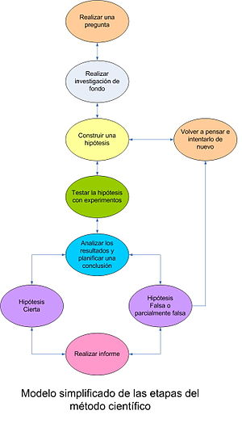

# FASE 0: Previ

## Planificació

Com resoldrem la pregunta guia? Expliqueu els passos que teniu pensats per resoldre el problema. Sigueu detallats/des. Que necessitarieu per resoldre'l.

**A1:** `Escriviu en 10 minuts l'estrategia que seguirieu per resoldre la pregunta. Definiu una llista de com a mínim 10 passos. `

## Avaluació

Quins aspectes creieu que la vostra presentació al final del projecte serà bona? Llista almenys 5 aspectes que ens demostrin que la vostra presentació serà una bona investigació, tant desde el punt e vista formal (la presentació està ben feta), com des del punt de vista del contingut (el que descriuen té sentit, ...). 

**A2:** `Llista de criteris per saber si la vostra presentació és correcta.`

## Mètode Científic

Com ja sabeu, el mètode científic és una eina molt sólida per crear nou coneixement. S'utilitza sobretot en la ciència per desmentir falacies i prejudicis cognictius. Serà el mètode que utilitzarem per demostrar si és un mite o un fet. 

 

[Youtube](https://www.youtube.com/watch?v=MIAhDCxUWiw)

**A3:** `Escriviu la vostra hipotesi sobre la pregunta guia. És un fet o és un mite. I sobretot, perquè?`

# FASE 1: Característiques de la Lluna

Com es mou la Lluna? I com la veiem desde el nostre punt de vista? Quines són les fases de la Lluna? 

[Fases Lunars](https://es.wikipedia.org/wiki/Fase_lunar)

* [Demostració de la fase Lunar](https://www.youtube.com/watch?v=wz01pTvuMa0), [Castellà](https://www.youtube.com/watch?v=lYhj4QJoVr4)
* Simulador de les fases de la Lluna: 

[Simulador de les fases de la Lluna](http://astro.unl.edu/naap/lps/animations/lps.html)

![Fases Lunars] (img/faseslunares.jpg)

**[Òrbita de la Lluna](https://es.wikipedia.org/wiki/%C3%93rbita_de_la_Luna)**

> El periodo de revolución de la Luna alrededor de la Tierra, llamado mes sidéreo es de 27,32 días, sin embargo el período entre una fase nueva y la siguiente, conocido como período sinódico, lunación, o mes sinódico es de 29,53 días. Esto se debe a que durante cada revolución de la   Luna la Tierra avanza unos 27° en su propia órbita alrededor del Sol, por lo que las posiciones relativas de los tres cuerpos no vuelven a ser  las mismas hasta entonces.

Hi han per tant dos periodes: 

* el mes sidéreo: 27,3217 dies
* el mes sinòdic: 29,5305882 dies.

## Stellarium

Utilitzarem el software Stellarium per veure quina fase lunar hi havia el dia del nostre naixement. Stellarium ens permet canviar l'ubicació d'on estem. Podem utilitzar el buscador, o posar les coordenades geogràfiques, que podem trobar a google maps.
Podem canviar també la data, per veure el cel el dia que nosaltres volem. Podem veure les constelacions per la nit i els planetes. També podem veure l'estrella polar (polaris), que ens indica el Nord, i si incrementem la velocitat del temps, podem veure com es manté fixe.
Aquesta estrella es veu desde l'hemisferi Sud? Si algú li interessa l'astronomia, Stellarium és un programa interessant per començar.

Stellarium ens serveix per saber quina fase lunar en una data concreta. Si ho hem de fer per totes les dates de naixement de l'institut, necessitem un altre mètode. Per això necessitem l'àlgebra, que ens permet generalitzar una operació i utilitzar-la en molts casos. Aquí és on entrarà el full de càlcul. 

**A4:** `Trobeu ara la fase de la lluna en el vostre naixement.`

Comprovació: [Calendario de las Fases Lunares](http://www.moonconnection.com/moon_phases_calendar.phtml)

# FASE 2: Enquesta

## Com ha de ser l'enquesta

Dissenyeu una enquesta!! Volem saber l'opinió de la gent sobre la nostra pregunta guia, i saber si posem extreure relacions entre les diferents variables que demanem. Hi ha més dones que creuen que és un mite, o per el contrari són més els homes? 

Existeixen diferents tipus d'enquestes. Enquestes poblacionals o enquestes mostrals. 

La vostra enquesta haurà d'estar feta en [Google Forms](drive.google.com). Utilitzarem un tipus d'enquesta d'una mostra aleatòria de persones que han de complir unes condicions. 

Exemple d'enquesta: 

| Nombre | Pregunta | 
| ------ |----------|
| 1 | Data de naixement   |
| 2 | Sexe: Home [  ] Dona [  ]   |
| 3 | Hi ha alguna relació entre el nombre de naixements i la fase lunar? Sí [  ]  No [  ]   |
| 4 | En quina fase crees que hi ha més naixements? Lluna nova, Lluna nova visible, Quart creixent, Lluna gibosa creixent, Lluna plena, Lluna gibosa minvant, Quart minvant, Lluna minvant, Lluna nova....   |
| 5 | Per què penses això?   |

L'enquesta serà un document LibreOffice Write on han d'estar com a mínim les preguntes que es demanen. En l'enquesta, haureu d'incloure una pregunta més per determinar si influeix algun altre factor. Com per exemple, si fan o no esport, nivel d'estudis, etc. (Aquests dos exemples no es poden utilitzar!).

## Mostra poblacional de l'enquesta

Escull aleatòriament un grup de persones, que han de ser MÍNIM  32 adults (16 dones i 16 homes) i 32 adolescents (16 noies i 16 nois). Cada estudiant preguntarà només a una sola persona. Poden ser més de 64, però s'han de preservar les proporcions de sexe i d'edat. 

# FASE 3: Càlcul de les fases de la lluna

## Altures i melics

Primer de tot, haurem de fer una petita introducció al full de càlcul, una eina ofimàtica molt útil. Farem una pràctica amb la vostra altura i l'altura del vostre mèlic. Poseu-vos per parelles, agafeu un metre, i mesureu-vos.  El principal problema a l'hora de mesurar són els possibles errors que podeu tenir a l'hora de mesurar.
Pregunta: 1-4-N: Com podem mesurar la nostra altura de la forma més exacte? Intenteu pensar un mètode per mesurar-la amb la màxima precisió?Penseu la forma més PRECISA per mesurar-vos. La importància de la mesura és la precisió. Heu de mesurar de cadascú dues mesures.
* La vostra altura
* L'altura del vostre mèlic desde el terra. 

Veure'm la relació que hi ha entre aquestes dues mesures, i un nombre molt important per les matemàtiques. 
(Treballar aquí les mitjanes, mitja, ...)

[Full de Càlcul Mostra](ods/Altures.ods)

Després utilitzarem totes les dates de naixement de l'institut per calcular quins dies de la setmana i quins mesos han nascut més alumnat. 

* [Taula de Freqüències](ods/TaulesFrequencies.ods)
* [Presentació sobre gràfics](ods/grafics2.odp)

### Fòrmules que necessitarem:

- = contar.si(A10:A20;2) → Cuenta el número de celdas del intervalo que va desde A10 hasta A20 que cumplen el criterio celda=2
- = suma(B2:B12) → Suma las celdas del intervalo desde B2 hasta B12.
- = díames(C3) → Devuelve el número de día de la semana de la fecha almacenada en la celda C3: 1 Domingo, 2 Sábado, 3 Lunes, ...
- = mes(C3) → Devuelve el mes de la fecha almacenada en la celda C3.
- = A2/$A$20 → Divide la celda A2 entre A20. En el caso de copiar la fórmula a otras celdas, el sistema actualizará automáticamente A2, pero NO A20.
- =entero(B4) → Devuelve el redondeo inferior de B4
- =abs(C3) → Devuelve el valor absoluto de C3
- =buscarv(E1;K11:L19;2) → Busca el valor de E1 en la tabla definida por el rango K11:L19 y, una vez encontrado, devuelve el valor de la segunda columna del rango, es decir, de la columna L.

**A5:** `Ara que ja has vist una taula de freqüències i gràfics, i segons la teva hipotesis, com creus que quedarà el teu gràfic de les fases de lluna?. dibuixa-l el gràfic i ensenya'l al professor.`

## Fases de la Lluna de 0 a 1

El nostre algorisme, el que utilitzarem per saber la fase de la Lluna ens dona els resultat amb un nombre entre 0 i 1. I a partir d'aquest nombre, hem de saber quina fase de la Lluna és. Hi han 8 fases de la Lluna. Aquestes fases les hem de repartir equitativament desde el 0 fins al 1. Como ho podem fer? Totes les marques han de ser iguals. 

**A6:** `Agafeu un full mil·limetrat, i marqueu el 0 i el 1. Penseu la forma de dividir aquesta línia en 8 parts. Podeu utilitzar el regle i la calculadora`

| Fases Luna              | Valor       | 
| ----------------------- |-------------|
| Luna Llena              | 0           |
| Luna gibosa Menguante   | 0,0625      |
| Cuarto Menguante        | 0,1875      |
| Luna Menguante          | 0,3125      |
| Luna Nueva              | 0,4375      |
| Luna Nueva Visible      | 0,5625      |
| Cuarto creciente        | 0,6875      |
| Gibosa Creciente        | 0,8125      |
| Luna Llena              | 0,9375      |

https://www.geogebra.org/graphing/dan7vfkr

## Algorisme de la fase de la Lluna

Un cop ja sabem quin resultat ens donarà l'algorisme, anem a presentar-lo. Aquest algorisme, el que necessita primer de tot és una lluna plena coneguda de referéncia. En podem trobar [aquí](http://aa.usno.navy.mil/data/docs/MoonPhase.php). 

1. El que fem després és restar la data de referéncia de la data de la qual volem saber nosaltres la seva fase lunar.
2. dividim el resultat per 29,530588, que com ja sabeu é el que triga la lluna en donar una volta a la terra.
3. Per acabar, el que fem és quedar-nos amb la part decimal de la divisió. 

El nombre que ens queda és la fase de la Lluna que ens interessa. 

[Algorisme Fases Lluna](ods/LunarCycle.ods)

**A7:** `Utilitzant alguna de les dades que teniu just a sota, trobeu les seves fases de la lluna, realitzeu les taules de freqüència, i els gràfics`

1. Dades de la classe
2. [Dades de l'institut](ods/MartaEstrada20172018.ods)
3. [Dades de tots els instituts de Granollers](ods/InstitutsGranollers20172018.ods)
4. [Dades de tota Catalunya](ods/Catalunya19852015.xls)

**A8:** `Escriviu una conclusió a partir de les vostres dades. S'ha complert la vostra hipotesis. Per què? Que us indiquen les dades i les gràfiques que heu realitzat? `

# FASE 4: Resultats de les enquestes

Les enquestes que vau fer ens poden ajudar a trobar alguna relació entre les opinions de la gent i les seves costums, aficions. És una persona que té un gos, més creien que és un mite o un fet respecte del total?

Aquestes relacions que podreu trobar són relacions dèbils. És a dir, que només hem trobat un indicador que ens diu que estan relacionades les dues dades. Hauriem de fer més investigacions i més estadística per poder corraborar que una dada està relacionada amb l'altre. 

Per fer això, haureu d'extreure les dades de les enquestes. Aquestes dades les haureu de treballar com hem fet fins ara, fent les seves taules de freqüencia. 

us deixo [aquí](ods/TaulesEnquestes.pdf) les taules que haureu de crear amb les vostres estadístiques. Aneu creant les taules de freqüència i les gràfiques una a sota de l'altre, en el mateix full de càlcul. Poseu títol a cada taula i gràfic. 

**A9:** `Haureu d'entregar aquest full de càlcul amb les dades omplertes i un document de text, explicant les vostres conclusions sobre les opinions de la gent.`

# FASE 5: Pecha Kucha

Què és un [Pecha Kucha](https://www.youtube.com/watch?v=M3F1h_BbUx0)?

## Recursos per crear un Pecha Kucha

Us passo una sèrie de recursos per a què pugueu muntar els vostres Pecha Kuchas!!!

Imatges:

* [10 diferentes buscadores de imagenes gratuitas](https://wwwhatsnew.com/2014/05/30/10-excelentes-buscadores-imagenes-gratuitas/)
* [Open Clipart](https://openclipart.org/)
* [Creative Commons](https://search.creativecommons.org/)
* [12 best places to get free images](http://www.techradar.com/news/internet/web/12-best-places-to-get-free-images-for-your-site-624818)

## Entrega

Ha de contenir com a mínim:

* Introducció
* La pregunta guia
* Resultats de l'opinió de la gent
* Explicació de les fases de la lluna
* Hipotesis
* Experiment
* Conclusions

**A10:** `Entrega del Pecha Kucha`

La presentació del Pecha Kucha serà gravada. Pujaré els videos de forma privada i els compartiré només amb vosaltres. Quan els hagueu vist, haureu d'entregar un document amb les 5 aspectes que més t'han agradat de la teva presentació, i els 5 aspectes que menys. En el moment en què entregueu el document, despenjaré els videos. 

TODO:  MathJax, geogebra, script per crear la documentació. Rúbriques de les activitats. 